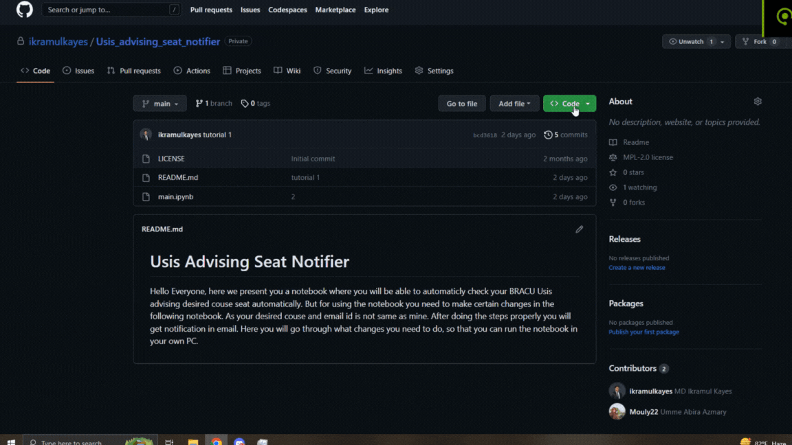

# Usis Advising Seat Notifier
<p>Hello Everyone, this notebook is an ease to your advising nightmare. By using this notebook you do not have to spend hours in checking whether your desirable section has an empty slot or not. The moment a seat will be empty, you will recieve an notification through mail in your device. For this, you need to fulfill some criteria. Follow the steps one by one in your own device.</p><br>

## Prerequisites:
The following softwares must be installed in your machine. After installing all of them you are good to go. <br>
1)```Google chrome```<br>
2)```Jupyter notebook```<br>
3)```Winrar```<br>


## Downloading files on your PC:

1)```Firstly, you need to download the zip file in the following way```




```2)Extract the zip file and run main.ipynb by using your jupyter notebook```

## Making changes in the main.ipynb:
(i)You need to provide your usis Email ID and password in the following lines(The libaries used in the notebook are all official libraries from python. So, you need not to worry about your Email and password getting stolen by anyone)<br>

(ii)Change in the line number 29 in the second cell of the notebook. Where you need to provide your USIS login email id replacing "My_usis_account@gmail.com"<br>

<br>


(iii) Change in the line number 34 in the second cell of the notebook. Where you need to provide your Password replacing "My_Usis_Password"<br>

<br>

(iv)In line 74, replace the CSE110 with the course you want select for instance CSE330, ENG101 etc<br>

 <br>

(v)In line 89, follow the steps of the following [video](https://www.youtube.com/watch?v=PrC0EEjlkis), starting from 3:34 to 5:30<br>
<br>

(vi)In line 94, follow the steps shown in the following [video](https://www.youtube.com/watch?v=PrC0EEjlkis), starting from 5:31 to 5:16.<br>
 <br>
(vii)In line 115, replace "My_microsoft_email@outlook.com","Password_of_my_outlook_account" , with the email adress and password of the notifying mail(Outlook Email must) just like the following "email, password".<br>

 <br>

(viii)In line 117, replace "My_microsoft_email@outlook.com","my_personal_email@gmail.com" , with the notifying mail id you used in the previous (vii) part and provide  the email adress where you want to get notified to (your personal mail) the format should be like this notifyingmail@microsoft.com, mypersonalmail@gmail.com.<br>


